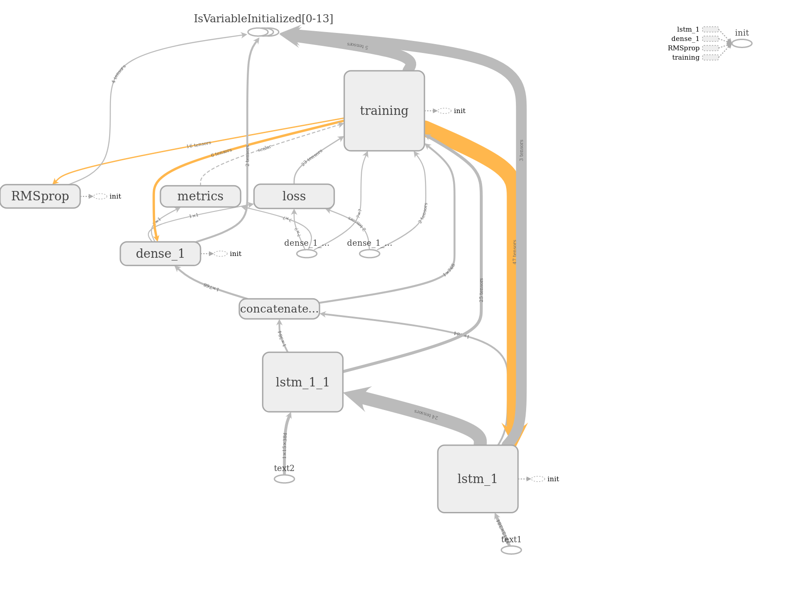
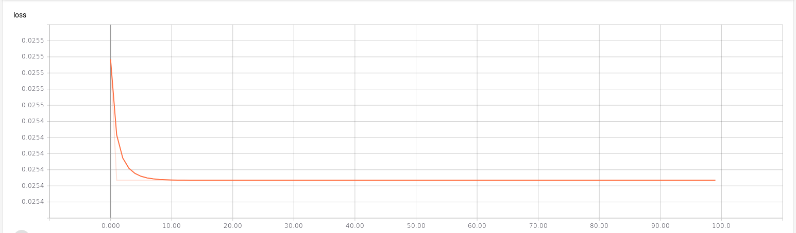

# metis #

## Starting point ##

We started with the following network:



which at the first run did not do so well:




### First run ###

The network was trained on `sts-dev.csv` file with 100 epochs and a batch size of 1.
``` shell
python lstm.py --input-file ../../data/sts-dev.csv \
	           --batch-size 1 \
			   --epochs 100
```
